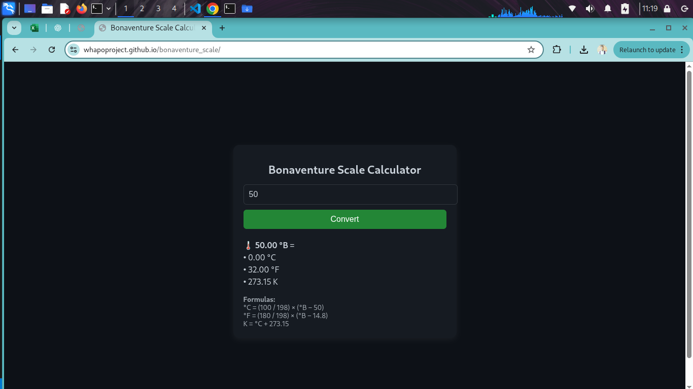

# Bonaventure Scale 🔥

**Bonaventure Scale** is a temperature measurement system invented by NIYIBIZI Bonaventure (aka niyo-sean). This Python package provides conversion functions between °B (Bonaventure), °C (Celsius), °F (Fahrenheit), and Kelvin.

---

## 🌡️ Supported Conversions

- °B ↔ °C
- °B ↔ °F
- °B ↔ K

---

## 📦 Installation

```bash
pip install git+https://github.com/whapoproject/bonaventure_scale.git
```

Or if you're developing locally:

```bash
git clone https://github.com/whapoproject/bonaventure_scale.git
cd bonaventure_scale
pip install -e .
```

---

## 🧪 Usage Example

```python
from bonaventure_scale import bonaventure_to_celsius, bonaventure_to_fahrenheit

b_temp = 90
print("Celsius:", bonaventure_to_celsius(b_temp))
print("Fahrenheit:", bonaventure_to_fahrenheit(b_temp))
```

---

## 📘 Formula Reference

- °C = (100 / 198) × (°B - 50)
- °F = (180 / 198) × (°B - 14.8)
- K = °C + 273.15

---

## 🖩 Interactive Calculator
- Try the Bonaventure Scale calculator instantly:  
- 🌡 [Open Calculator](https://whapoproject.github.io/bonaventure_scale/)


## 🔧 Development

This package supports `pytest` testing.

```bash
pytest -v
```

---

## 🛡 License

This project is licensed under the MIT License.

---

## 👤 Author

**Bonaventure**  
Software Engineer & Red Team Specialist  
Stage name: niyo-sean  
Registered at RDB as intellectual property
